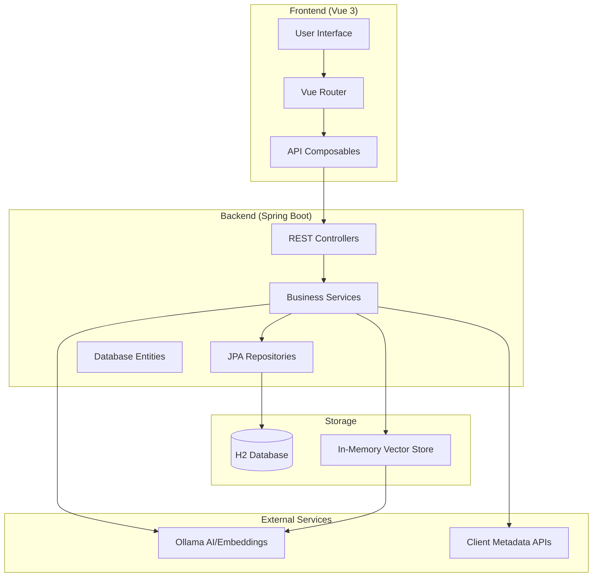
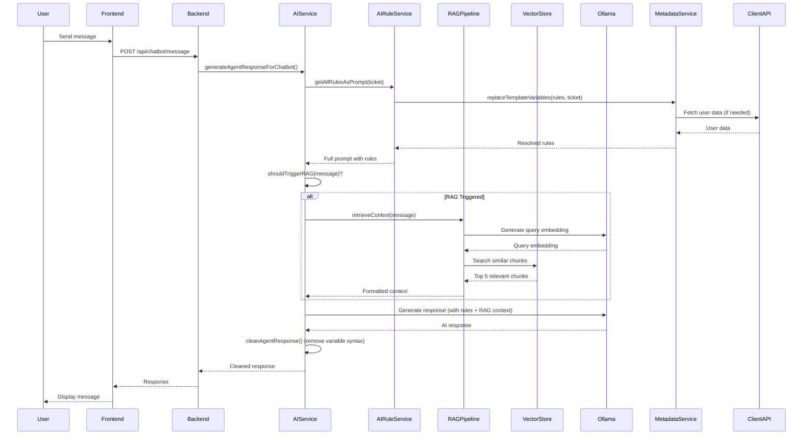
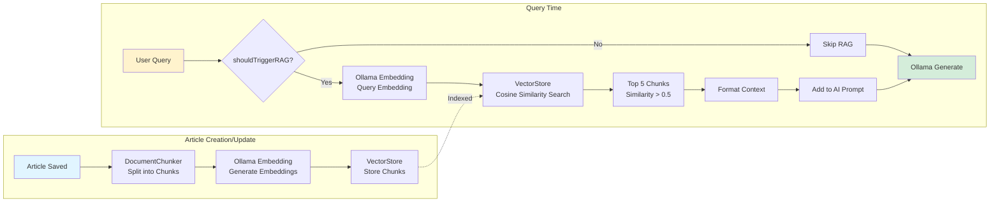
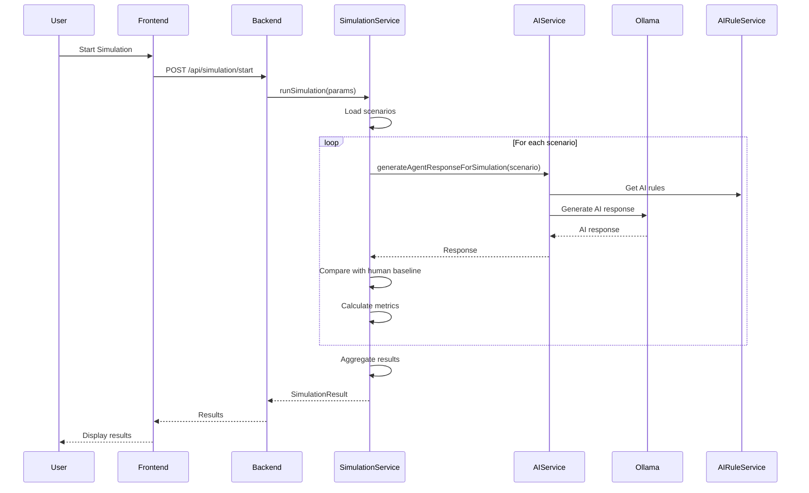
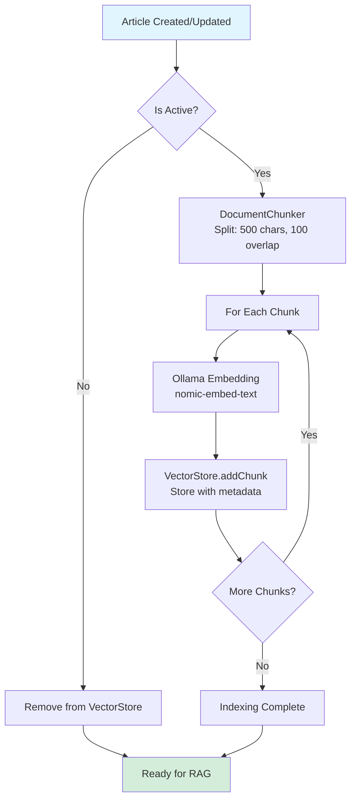
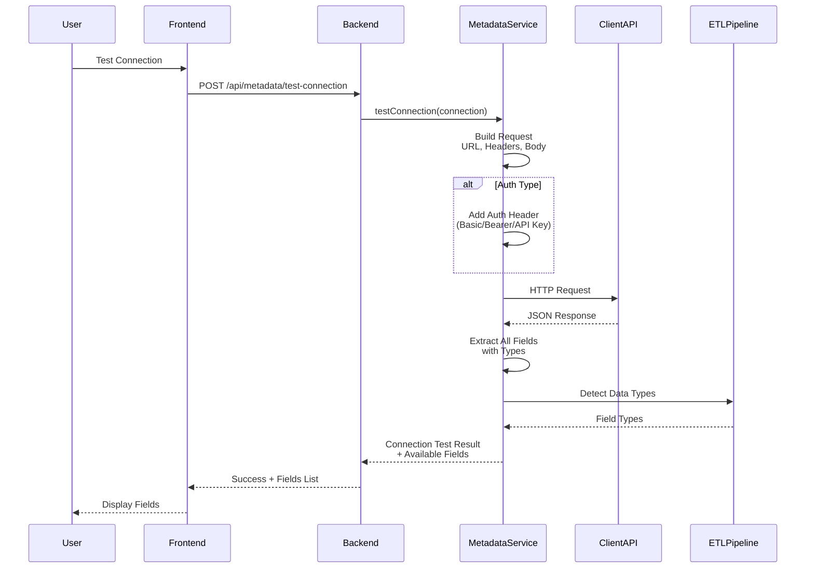

# Demo Platform - Complete Feature Documentation

## Table of Contents
1. [Platform Overview](#platform-overview)
2. [Architecture](#architecture)
3. [Core Features](#core-features)
4. [Data Flows](#data-flows)
5. [API Endpoints](#api-endpoints)
6. [Configuration](#configuration)

---

## Platform Overview

The **Demo Platform** is a comprehensive AI-powered customer service analytics and management system. It provides tools for ticket management, AI-driven customer interactions, knowledge base management, metadata configuration, and advanced analytics.

### Key Capabilities
- **Ticket Management**: Full lifecycle management of customer support tickets
- **AI Customization**: Configurable AI behavior through rule-based system
- **RAG (Retrieval-Augmented Generation)**: Semantic search over knowledge base
- **Metadata Integration**: Connect external APIs and map data to internal variables
- **Simulation Suite**: Test AI performance against human agents
- **Analytics Dashboard**: Comprehensive insights and metrics
- **Chatbot Interface**: End-user and agent-facing chat interfaces

---

## Architecture

### Technology Stack

**Backend:**
- Java 21 + Spring Boot 3.2+
- Spring Data JPA / Hibernate
- H2 Database (file-based persistence)
- Ollama (AI & Embeddings)
- Stanford CoreNLP (Sentiment Analysis)

**Frontend:**
- Vue 3 + TypeScript
- Vite
- Vue Router
- Composables pattern for API interaction

### System Architecture Diagram



---

## Core Features

### 1. Ticket Management (`/tickets`)

**Purpose**: Manage customer support tickets throughout their lifecycle.

**Features:**
- View all tickets with filtering and sorting
- Create new tickets
- View ticket details with message history
- Update ticket status, priority, and category
- Add messages to tickets
- Dynamic customer profile fields (configurable via Metadata Configuration)
- Sentiment analysis on messages

**Data Model:**
- `Ticket`: ID, user, status, priority, category, created/updated dates
- `TicketMessage`: Content, sender type (CUSTOMER/AGENT), timestamp
- `User`: Basic user information

**Key Components:**
- `TicketsView.vue` (Frontend)
- `TicketController.java`, `TicketService.java` (Backend)

---

### 2. Analytics Dashboard (`/analytics`)

**Purpose**: Provide insights and metrics on ticket performance and AI behavior.

**Features:**
- Ticket volume statistics
- Response time metrics
- Sentiment analysis trends
- Category and priority distribution
- AI vs Human performance comparison
- Time-based analytics

**Key Components:**
- `AnalyticsView.vue` (Frontend)
- `AnalyticsController.java`, `AnalyticsService.java`, `DashboardAnalysisService.java` (Backend)

---

### 3. Simulation Suite (`/simulation`)

**Purpose**: Test AI customer service performance against human agents.

**Features:**
- Run simulations with predefined scenarios
- Compare AI responses to human agent responses
- Real-time progress tracking
- Review simulation results
- Category-based ticket organization
- Performance metrics per simulation

**Workflow:**
1. Select simulation parameters
2. Start simulation
3. AI processes each ticket scenario
4. Compare results with human baseline
5. Review detailed results

**Key Components:**
- `SimulationView.vue` (Frontend)
- `SimulationController.java`, `SimulationService.java` (Backend)
- `AIService.generateAgentResponseForSimulation()` (Backend)

---

### 4. AI Customization (`/ai-customisation`)

**Purpose**: Configure AI behavior through rule-based system with priority levels.

**Features:**
- **Three Priority Levels** (Browser Tabs):
  1. **General AI Rules** (Lowest Priority): Base behavior rules
  2. **Escalation Rules** (Medium Priority): Override general rules
  3. **Additional AI Rules** (Highest Priority): Edge cases and specific scenarios
  
- Multiple titled rule boxes per category
- Template variable support (e.g., `{{user.name}}`, `{{order.total}}`)
- Hoverable/clickable modal listing all available variables
- Rules are strictly enforced - AI acts as a "skeleton" built by instructions

**Data Model:**
- `AIRule`: Category, title, content, display order, active status

**Key Components:**
- `AIConfigurationView.vue` (Frontend)
- `AIRuleController.java`, `AIRuleService.java` (Backend)

**Priority System:**
```
Additional AI Rules (Highest)
    ↓
Escalation Rules (Medium)
    ↓
General AI Rules (Lowest)
```

---

### 5. AI Data Access (`/ai-data-access`)

**Purpose**: Control which metadata variables the AI can access.

**Features:**
- **Two Tabs:**
  - **3rd Party Integrations**: External API connections (future)
  - **Direct Integrations**: All mapped metadata variables
  
- Toggle AI access per variable
- Test value resolution for each variable
- View connection source for each variable
- Bulk update AI access settings

**Key Components:**
- `AIDataAccessView.vue` (Frontend)
- `MetadataController.java` (Backend endpoints for AI access control)

---

### 6. Chatbot (`/chatbot`)

**Purpose**: Provide chat interfaces for end-users and agents.

**Features:**
- **Two Tabs:**
  - **End User Chatbot**: Customer-facing interface
  - **Agent Chatbot**: Agent-facing interface with customer profile panel
  
- Real-time conversation
- AI-powered responses using RAG and AI Customization
- Conversation history (last 4 messages)
- End chat and save as ticket (End User)
- Editable customer profile fields (Agent)
- Dynamic customer information display

**Key Components:**
- `ChatbotView.vue`, `EndUserChatbot.vue`, `AgentChatbot.vue` (Frontend)
- `ChatbotController.java`, `AIService.generateAgentResponseForChatbot()` (Backend)

---

### 7. Knowledge Base (`/knowledge-base`)

**Purpose**: Manage articles and categories for RAG system.

**Features:**
- Create and manage categories
- Create articles with rich text content
- Organize articles by category
- Active/inactive article status
- Automatic RAG indexing on article creation/update
- Three-column layout: Categories | Articles | Editor

**Data Model:**
- `Category`: Name, articles (one-to-many)
- `Article`: Title, HTML content, category, active status

**RAG Integration:**
- Articles are automatically chunked (500 chars, 100 char overlap)
- Embeddings generated via Ollama `nomic-embed-text`
- Stored in in-memory vector store
- Semantic search with cosine similarity (threshold: 0.5)

**Key Components:**
- `KnowledgeBaseView.vue` (Frontend)
- `KnowledgeBaseController.java`, `KnowledgeBaseService.java` (Backend)
- `RAGPipeline`, `DocumentChunker`, `VectorStore` (Backend)

---

### 8. Metadata Configuration

**Purpose**: Connect external APIs and map data to internal template variables.

#### 8.1 Inbound Metadata (`/metadata-configuration/inbound`)

**Features:**
- Add API connections (REST endpoints)
- Configure authentication (None, Basic, Bearer, API Key)
- Test API connections
- View all connections and their status
- Navigate to field mapping editor

**Data Model:**
- `MetadataConnection`: Name, URL, method, auth type, headers, body template, active status

#### 8.2 Field Mapping (`/metadata-configuration/mapping/:id`)

**Features:**
- Discover all fields from API response
- Map external fields to internal variables (e.g., `username.name` → `{{user.name}}`)
- Create custom variables
- Set data types (STRING, INTEGER, DECIMAL, BOOLEAN, DATE, EMAIL, etc.)
- ETL pipeline for data transformation
- Test field mappings

**Data Model:**
- `MetadataFieldMapping`: Connection, external field path, internal variable, data type, active status, AI accessible flag

#### 8.3 Chat Fields (`/metadata-configuration/chat-fields`)

**Features:**
- Configure which metadata fields appear in Agent Chatbot customer profile
- Set field labels, types, icons
- Control visibility and editability
- Set display order
- Map to metadata variables
- Emoji picker for icons

**Data Model:**
- `CustomerProfileField`: Label, key, metadata variable, type, display order, visibility, editability, icon

#### 8.4 Ticket Fields (`/metadata-configuration/ticket-fields`)

**Features:**
- Configure which metadata fields appear on Tickets page
- Similar to Chat Fields but for ticket view
- Map to metadata variables
- Control visibility and editability

**Data Model:**
- `TicketField`: Label, key, metadata variable, type, display location, display order, visibility, editability

**Key Components:**
- `InboundMetadataView.vue`, `MetadataMappingView.vue`, `ChatFieldsView.vue`, `TicketFieldsView.vue` (Frontend)
- `MetadataController.java`, `MetadataService.java`, `ETLPipeline.java` (Backend)

---

## Data Flows

### 1. Chatbot Message Flow



### 2. Metadata Variable Resolution Flow

```mermaid
flowchart TD
    Start[Template Variable Found<br/>e.g., {{user.name}}] --> CheckType{Variable Type?}
    
    CheckType -->|Standard User Field<br/>e.g., user.name| UserEntity[Resolve from User Entity<br/>Ticket.getUser().getName()]
    CheckType -->|Mapped Variable<br/>e.g., order.total| MetadataMapping[Find MetadataFieldMapping]
    
    MetadataMapping --> CheckAIAccess{AI Accessible?}
    CheckAIAccess -->|No| ReturnEmpty[Return Empty/Ask User]
    CheckAIAccess -->|Yes| GetConnection[Get MetadataConnection]
    
    GetConnection --> BuildURL[Build Dynamic URL<br/>Inject ticket.id, user.id]
    BuildURL --> BuildBody[Build Request Body<br/>Inject variables]
    BuildBody --> MakeRequest[Make HTTP Request<br/>to Client API]
    
    MakeRequest --> ParseResponse[Parse JSON Response]
    ParseResponse --> ExtractValue[Extract Value from Path<br/>e.g., order.total]
    ExtractValue --> ETLTransform[ETL Pipeline<br/>Transform by Data Type]
    
    ETLTransform --> ReturnValue[Return Resolved Value]
    UserEntity --> ReturnValue
    ReturnValue --> End[Replace in Template]
    
    style Start fill:#e1f5ff
    style End fill:#d4edda
    style ReturnEmpty fill:#f8d7da
```

### 3. RAG (Retrieval-Augmented Generation) Flow



### 4. Simulation Flow



### 5. Knowledge Base Article Indexing Flow



### 6. AI Prompt Construction Flow

```mermaid
flowchart TD
    Start[Generate AI Response] --> LoadRules[Load AI Rules by Priority]
    
    LoadRules --> Priority1[Additional AI Rules<br/>Highest Priority]
    Priority1 --> Priority2[Escalation Rules<br/>Medium Priority]
    Priority2 --> Priority3[General AI Rules<br/>Lowest Priority]
    
    Priority3 --> ReplaceVars[Replace Template Variables<br/>{{user.name}} → [ASK_USER_FOR_NAME]]
    ReplaceVars --> CheckRAG{Should Trigger RAG?}
    
    CheckRAG -->|Yes| RAGContext[RAG Context<br/>Knowledge Base Info]
    CheckRAG -->|No| NoRAG[Skip RAG]
    
    RAGContext --> BuildPrompt[Build Final Prompt]
    NoRAG --> BuildPrompt
    
    BuildPrompt --> Sections[Order Sections:<br/>1. MANDATORY EXECUTION RULES<br/>2. RAG Context (if any)<br/>3. Current Message<br/>4. Conversation History]
    
    Sections --> SendOllama[Send to Ollama<br/>temperature: 0.3<br/>max_tokens: 300]
    SendOllama --> Clean[Clean Response<br/>Remove {{...}} syntax<br/>Remove meta-commentary]
    Clean --> Return[Return to User]
    
    style Start fill:#e1f5ff
    style Return fill:#d4edda
```

### 7. Metadata Connection Test Flow



---

## API Endpoints

### Ticket Management
- `GET /api/tickets` - Get all tickets
- `GET /api/tickets/{id}` - Get ticket by ID
- `POST /api/tickets` - Create ticket
- `PUT /api/tickets/{id}` - Update ticket
- `POST /api/tickets/{id}/messages` - Add message to ticket

### Analytics
- `GET /api/analytics/dashboard` - Get dashboard metrics
- `GET /api/analytics/tickets` - Get ticket analytics

### Simulation
- `POST /api/simulation/start` - Start simulation
- `GET /api/simulation/results/{id}` - Get simulation results

### AI Customization
- `GET /api/ai-rules` - Get all AI rules
- `POST /api/ai-rules` - Save AI rules (bulk)
- `GET /api/ai-rules/category/{category}` - Get rules by category

### Chatbot
- `POST /api/chatbot/message` - Send message to chatbot
- `POST /api/chatbot/end-chat` - End chat and save as ticket

### Knowledge Base
- `GET /api/knowledge-base/categories` - Get all categories
- `POST /api/knowledge-base/categories` - Create category
- `GET /api/knowledge-base/articles` - Get all articles
- `POST /api/knowledge-base/articles` - Create article
- `PUT /api/knowledge-base/articles/{id}` - Update article
- `DELETE /api/knowledge-base/articles/{id}` - Delete article

### Metadata Configuration
- `GET /api/metadata/connections` - Get all connections
- `POST /api/metadata/connections` - Create connection
- `POST /api/metadata/test-connection` - Test API connection
- `GET /api/metadata/mappings/{connectionId}` - Get mappings for connection
- `POST /api/metadata/mappings` - Save mappings
- `GET /api/metadata/mappings/ai-access` - Get mappings for AI access control
- `PUT /api/metadata/mappings/{id}/ai-access` - Update AI access for mapping
- `GET /api/metadata/variables/available` - Get available metadata variables

### Customer Profile Fields
- `GET /api/customer-profile/fields` - Get all fields
- `POST /api/customer-profile/fields` - Create field
- `PUT /api/customer-profile/fields/{id}` - Update field
- `DELETE /api/customer-profile/fields/{id}` - Delete field
- `GET /api/customer-profile/data/{ticketId}` - Get resolved profile data

### Ticket Fields
- `GET /api/ticket-fields` - Get all fields
- `GET /api/ticket-fields/location/{location}` - Get fields by location
- `POST /api/ticket-fields` - Create field
- `PUT /api/ticket-fields/{id}` - Update field
- `DELETE /api/ticket-fields/{id}` - Delete field
- `GET /api/ticket-fields/data/{ticketId}/{location}` - Get resolved field data

---

## Configuration

### Environment Variables

**Backend:**
- `SPRING_PROFILES_ACTIVE=dev` - Spring profile
- `OLLAMA_BASE_URL=http://localhost:11434` - Ollama service URL

**Frontend:**
- `VITE_API_BASE_URL=http://localhost:8080/api` - Backend API URL

### Database

- **Type**: H2 Database (file-based)
- **Location**: `backend/data/prototype.mv.db`
- **Persistence**: Data persists between restarts
- **Schema**: Auto-generated by JPA/Hibernate

### Ollama Setup

1. Install Ollama: https://ollama.ai
2. Pull embedding model:
   ```bash
   ollama pull nomic-embed-text
   ```
3. Ensure Ollama is running on `http://localhost:11434`

### RAG Configuration

- **Embedding Model**: `nomic-embed-text`
- **Chunk Size**: 500 characters
- **Chunk Overlap**: 100 characters
- **Similarity Threshold**: 0.5 (cosine similarity)
- **Max Chunks Retrieved**: 5

### AI Configuration

- **Model**: Ollama (default model)
- **Temperature**: 0.3 (for consistency)
- **Max Tokens**: 300
- **Conversation History**: Last 4 messages

---

## Data Models

### Core Entities

**Ticket**
- `id`, `user`, `status`, `priority`, `category`
- `createdAt`, `updatedAt`
- `messages` (one-to-many)

**TicketMessage**
- `id`, `ticket`, `content`, `senderType`
- `createdAt`, `sentimentScore`

**User**
- `id`, `uid`, `name`, `email`, `location`

**AIRule**
- `id`, `category` (GENERAL, ESCALATION, ADDITIONAL)
- `title`, `content`, `displayOrder`, `isActive`

**Article**
- `id`, `title`, `content` (HTML), `category`, `isActive`

**Category**
- `id`, `name`, `articles` (one-to-many)

**MetadataConnection**
- `id`, `name`, `url`, `requestMethod`, `authType`
- `headers`, `requestBodyTemplate`, `isActive`

**MetadataFieldMapping**
- `id`, `connection`, `externalFieldPath`, `internalVariable`
- `dataType`, `isActive`, `aiAccessible`

**CustomerProfileField**
- `id`, `fieldLabel`, `fieldKey`, `metadataVariable`
- `fieldType`, `displayOrder`, `isVisible`, `isEditable`, `icon`

**TicketField**
- `id`, `fieldLabel`, `fieldKey`, `metadataVariable`
- `fieldType`, `displayLocation`, `displayOrder`, `isVisible`, `isEditable`

---

## Key Design Principles

1. **AI as Skeleton**: AI behavior is entirely driven by user-defined rules, no hardcoded behaviors
2. **Priority System**: Rules are applied in priority order (Additional > Escalation > General)
3. **Template Variables**: Dynamic data injection via `{{variable}}` syntax
4. **User Isolation**: Metadata resolution is scoped to specific users/tickets
5. **RAG Intelligence**: RAG only triggers for factual queries, not conversational messages
6. **Strict Enforcement**: Configuration rules are mandatory, not suggestions
7. **ETL Pipeline**: All external data is transformed to consistent types
8. **Granular Access Control**: AI access to metadata can be toggled per variable

---

## Future Enhancements

- Authentication & Authorization
- Multi-tenant support
- Advanced analytics with ML models
- Real-time notifications
- Webhook support for external integrations
- Advanced RAG with reranking
- Multi-language support
- Export/Import configurations

---

## Support & Troubleshooting

### Common Issues

**RAG not working:**
- Ensure Ollama is running: `ollama serve`
- Verify model is installed: `ollama list`
- Check backend logs for embedding errors

**Metadata variables not resolving:**
- Verify API connection is active
- Check field mapping is correct
- Ensure `aiAccessible` is true if used in AI responses
- Check ETL pipeline logs for transformation errors

**AI not following rules:**
- Verify rules are saved and active
- Check rule priority order
- Ensure template variables are properly formatted
- Review AI prompt in backend logs

---

**Document Version**: 1.0  
**Last Updated**: 2024  
**Platform**: Demo Platform V.1.0 Proto

